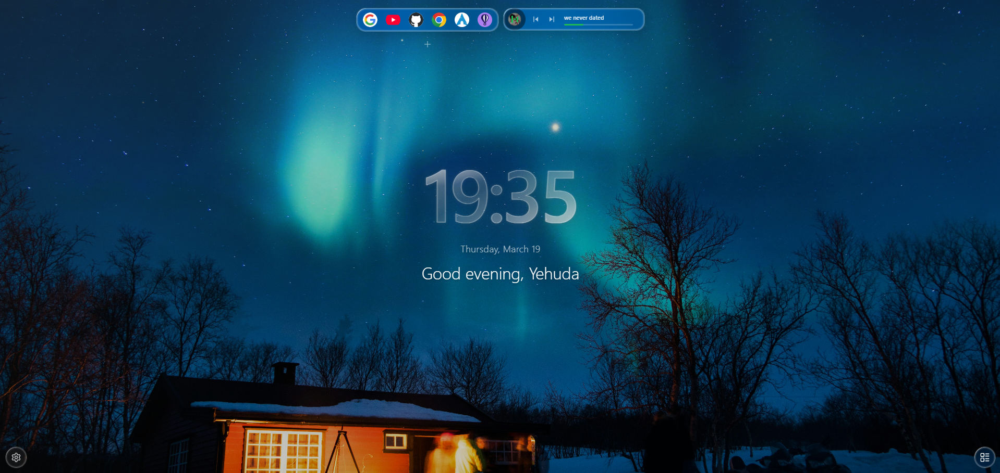

## Coming Soon!

# WindoM

**The new tab you always wanted.**

A Chrome extension that turns every new tab into a personal productivity dashboard —
clock, weather, todos, calendar, Spotify, quick links, focus timer, and more.
Built with a clean glassmorphism design.

 

---

WindoM redefines the new tab experience. Instead of an empty page, every new tab opens to a thoughtfully designed personal dashboard that gives you everything you need to start your day with clarity and intention.

Built around a clean glassmorphism aesthetic, WindoM feels as good as it looks — smooth, minimal, and always out of the way when you need it to be.

At a glance, you see the time, the weather outside, your upcoming calendar events, what is playing on Spotify, and your tasks for the day. Everything you actually care about, nothing you do not.

---

## Features

| | |
|---|---|
| Clock & greeting | Personalized, adapts to the time of day |
| Weather | Real-time via OpenWeatherMap |
| Backgrounds | Unsplash or your own images |
| Google Calendar | Optional sync for upcoming events |
| Spotify | Now-playing widget |
| Todos | Local task list |
| Focus Mode | Distraction-free countdown timer |
| Quick Links & Dock | Pinned shortcuts on every tab |
| Daily Quotes | A new one every day |
| Settings | Every detail is configurable |

---

## Install

**From the Chrome Web Store** (recommended):

<!-- [Install WindoM](https://chromewebstore.google.com/detail/windom/comcnbccalbfcegbmaemancbhgpijkpb) -->
Install WindoM - Soon!

**Run locally:**

See the [Local Setup Guide](https://yehudabriskman.github.io/WindoM/local-setup.html).

---

## Tech stack

**Extension** - React 18, TypeScript, Vite, Tailwind CSS v4, CRXJS, Manifest V3

**Backend** - Fastify v5, Drizzle ORM, PostgreSQL 16, TypeScript ESM

---

## Contributing

Contributions are welcome. See [CONTRIBUTING.md](CONTRIBUTING.md) for guidelines.

---

## Privacy

WindoM does not track you. All personal data stays in your browser. An account is optional and only needed for Google Calendar and Spotify features. Read the full [Privacy Policy](https://yehudabriskman.github.io/WindoM/privacy.html).

---

## License

MIT — see [LICENSE](LICENSE)
