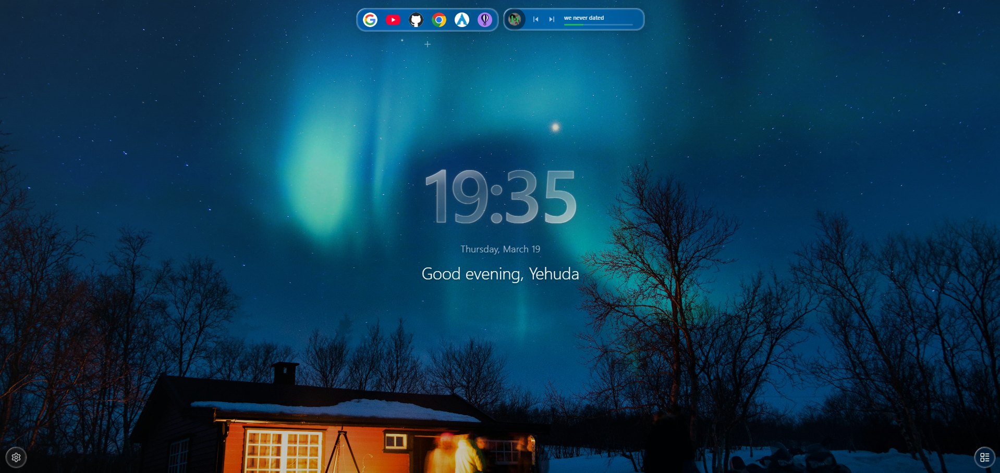
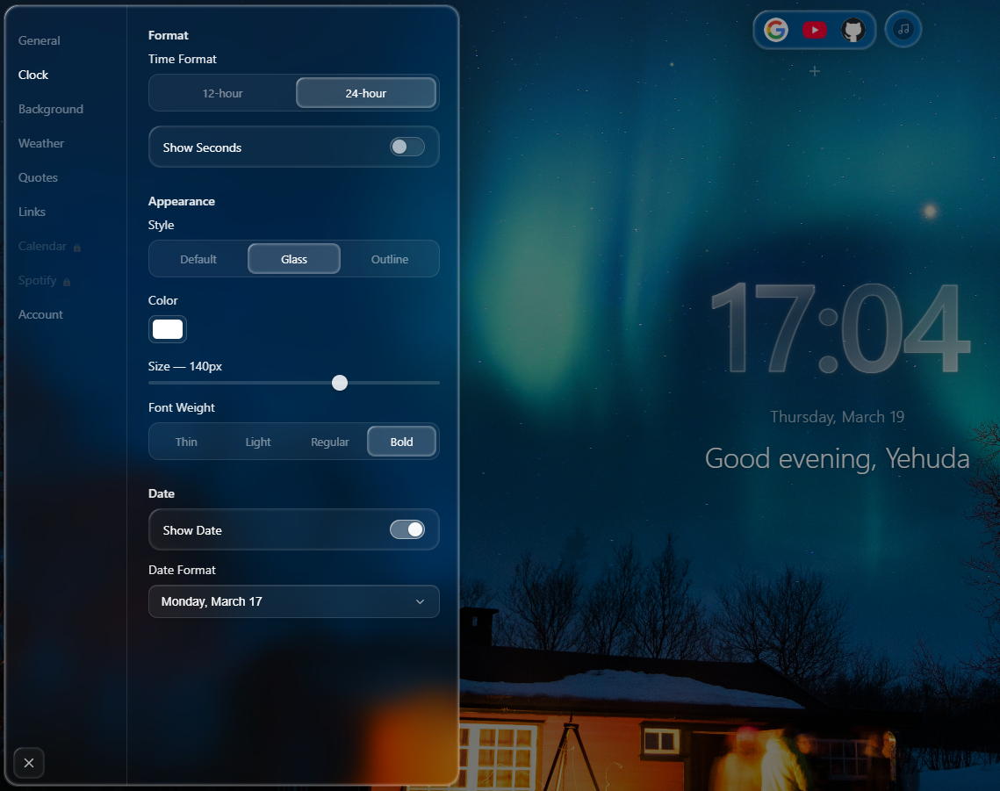
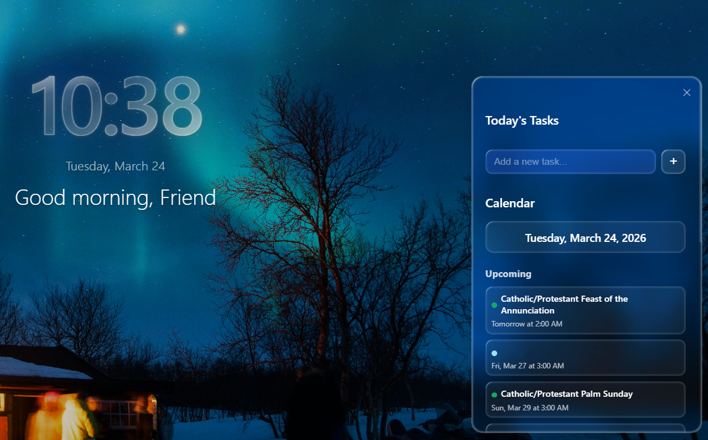
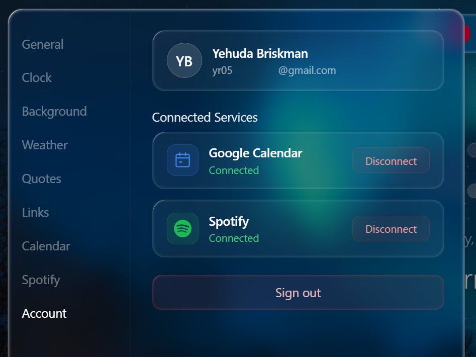

<div align="center">


<br />
<br />

# WindoM

**Your Space, Your Flow · Made to Fit You**

A Chrome extension that turns every new tab into a personal productivity dashboard —
clock, weather, todos, Google Calendar, Gmail inbox, Spotify, live stock & crypto prices,
quick links, focus timer, and more. All the essentials in one new tab, built with a clean glassmorphism design.

<br />

<!-- Install & Web -->
[](https://chromewebstore.google.com/detail/windom/comcnbccalbfcegbmaemancbhgpijkpb)
[](https://windom.app)
[](https://www.linkedin.com/company/windom-app/)
<!-- Community & Stats -->
[](https://chromewebstore.google.com/detail/windom/comcnbccalbfcegbmaemancbhgpijkpb)
[](https://github.com/YehudaBriskman/WindoM/stargazers)
[](https://github.com/YehudaBriskman/WindoM/graphs/contributors)
[](https://github.com/YehudaBriskman/WindoM/network/members)
<!-- Meta -->
[](CHANGELOG.md)
[](LICENSE)
[](CONTRIBUTING.md)
[](https://github.com/YehudaBriskman/WindoM/issues)
<!-- Tech Stack -->


<br />
<br />



</div>

---

WindoM redefines the new tab experience. Instead of an empty page, every new tab opens to a thoughtfully designed personal productivity dashboard that gives you everything you need to start your day with clarity and intention.

Built around a clean glassmorphism aesthetic, WindoM feels as good as it looks — smooth, minimal, and always out of the way when you need it to be.

At a glance you see the time, the weather, your upcoming calendar events, unread Gmail, what's playing on Spotify, live stock and crypto prices, and your tasks for the day. Everything you actually care about, nothing you don't.

---

## Screenshots

<div align="center">
<table>
<tr>
<td align="center" width="33%">
<br/>
<sub><b>Main Dashboard</b></sub>
</td>
<td align="center" width="33%">
<br/>
<sub><b>Settings Panel</b></sub>
</td>
<td align="center" width="33%">
<br/>
<sub><b>Sidebar</b></sub>
</td>
</tr>
<tr>
<td align="center" colspan="3">
<br/>
<sub><b>Account & Integrations</b></sub>
</td>
</tr>
</table>
</div>

---

## Why WindoM?

Most new tab extensions do one thing. WindoM does everything - and does it beautifully.
A clean new tab dashboard built for focus, customization, and your daily flow.

| Pain point | WindoM's answer |
|---|---|
| Blank new tab wastes a micro-moment | Instant glance at time, weather, todos, calendar |
| Widget apps clutter your taskbar | Lives exactly where you already look - the new tab |
| Glassmorphism dashboards feel heavy | Sub-second load, zero network calls for the core UI |
| Integrations break after OAuth expires | Silent automatic token refresh, cross-tab sync |
| "Productivity" apps demand attention | Focus Mode hides everything and lets you just work |
| Your background gets stale | Rotating Unsplash images or your own photos |

---

## Features

| | Feature | Detail |
|---|---|---|
| ⏰ | Clock & Greeting | Personalized, adapts to the time of day |
| 🌤️ | Weather | Real-time via OpenWeatherMap |
| 🖼️ | Backgrounds | Unsplash rotation or your own uploaded image |
| 📅 | Google Calendar | Upcoming events synced to the sidebar |
| ✉️ | Gmail Inbox | Unread count + 5 recent messages in the sidebar, refreshes every 45s |
| 🎵 | Spotify | Now-playing widget + playback controls + top tracks |
| 📈 | Finance Dashboard | Live stocks & crypto — Yahoo Finance + CoinGecko, no API key needed |
| ✅ | Todos | Local task list, always in the sidebar |
| 🕰️ | Tab History | Recent browsing history in the sidebar |
| ⏱️ | Focus Mode | Distraction-free countdown timer |
| 🔗 | Quick Links & Dock | Pinned shortcuts on every tab |
| 💬 | Daily Quotes | A new one every day |
| 🔍 | Search Bar | Google, Bing, DuckDuckGo, or Brave |
| 🔒 | Auth System | Optional account — Google Sign-in or email, JWT + refresh token rotation |
| ⚙️ | Apps Hub | Unified settings panel — one card per integration |

---

## Install

**From the Chrome Web Store** (recommended):

[](https://chromewebstore.google.com/detail/windom/comcnbccalbfcegbmaemancbhgpijkpb)

**Run locally:**

See the [Local Setup Guide](https://yehudabriskman.github.io/WindoM/local-setup.html).

**Browser support:**

| Browser | Status |
|---|---|
| Chrome 112+ | Fully supported |
| Edge (Chromium) | Fully supported |
| Brave | Fully supported |
| Firefox | Not supported (Manifest V3 differences) |

---

## Tech Stack

### Extension

| Layer | Technology |
|---|---|
| UI | React 18 + TypeScript |
| Bundler | Vite + CRXJS |
| Styling | Tailwind CSS v4 + custom glassmorphism |
| Extension API | Chrome Manifest V3 |
| State persistence | `chrome.storage.sync` / `chrome.storage.local` |

### Backend

| Layer | Technology |
|---|---|
| Server | Fastify v5 (TypeScript ESM) |
| ORM | Drizzle ORM |
| Database | PostgreSQL 16 |
| Auth | JWT + refresh token rotation, AES-GCM encryption |
| Hosting | Fly.io |
| CI/CD | GitHub Actions |

---

## Project Structure

```
WindoM/
├── web/                # Chrome extension (React + Vite)
│   ├── src/
│   │   ├── components/ # UI - grouped by feature domain
│   │   ├── contexts/   # Global state (settings, auth, background, focus)
│   │   ├── hooks/      # Per-feature data hooks
│   │   ├── lib/        # Chrome storage wrappers, API client
│   │   └── types/      # Shared TypeScript types
│   └── manifest.json
├── backend/            # Fastify API server
├── docs/               # GitHub Pages site (privacy policy, local setup)
└── .github/workflows/  # Auto-deploy and auto-publish pipelines
```

---

## Contributing

Contributions are welcome. See [CONTRIBUTING.md](CONTRIBUTING.md) for guidelines.

[](https://github.com/YehudaBriskman/WindoM/graphs/contributors)

Ways to contribute:
- Report a bug via [Issues](https://github.com/YehudaBriskman/WindoM/issues)
- Suggest a feature via [Discussions](https://github.com/YehudaBriskman/WindoM/discussions)
- Submit a pull request - see [CONTRIBUTING.md](CONTRIBUTING.md)
- Leave a review on the [Chrome Web Store](https://chromewebstore.google.com/detail/windom/comcnbccalbfcegbmaemancbhgpijkpb)

---

## Changelog

See [CHANGELOG.md](CHANGELOG.md) for the full version history.

Current version: **1.4.0**

---

## Privacy

WindoM does not track you. All personal data stays in your browser. An account is optional and only needed for Google Calendar, Gmail, and Spotify features. Finance data is fetched directly from public APIs with no account required. Read the full [Privacy Policy](https://yehudabriskman.github.io/WindoM/privacy.html).

---

## Links

| Description | Links |
|---|---|
| Website | [windom.app](https://windom.app) |
| Chrome Web Store | [Install WindoM](https://chromewebstore.google.com/detail/windom/comcnbccalbfcegbmaemancbhgpijkpb) |
| LinkedIn | [WindoM on LinkedIn](https://www.linkedin.com/company/windom-app/) |
| Privacy Policy | [Privacy Policy](https://yehudabriskman.github.io/WindoM/privacy.html) |
| Local Setup | [Local Setup Guide](https://yehudabriskman.github.io/WindoM/local-setup.html) |
| Issues | [GitHub Issues](https://github.com/YehudaBriskman/WindoM/issues) |
| Discussions | [GitHub Discussions](https://github.com/YehudaBriskman/WindoM/discussions) |

---

## License

MIT - see [LICENSE](LICENSE)
